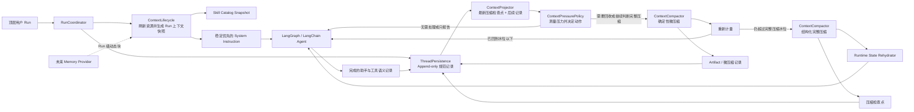

# Harness Code 上下文管理顶层开发方案

> 状态：已评审通过，已生成开发任务<br>
> 日期：2026-07-31<br>
> 对应需求：[上下文管理改造需求](上下文管理改造需求.md)<br>
> 所属仓库：Harness Code，设计基准 `master@042e7865ad9dd8bc7f27b12dfcd39319fbc74bdd`<br>
> SDD 阶段：Design / Plan<br>
> 评审门禁：已通过；正式任务为 [HC-101](../task/archive/HC-101-Thread规范记录与Plug.md)～[HC-107](../task/archive/HC-107-legacy-完成上下文连续性切换与端到端恢.md)<br>
> 路径同步：2026-09-10，模块路径已按 HC-098 后目录布局（`host/runtime/threads/config/policy/tools/extensions/protocol`）更新；本文为 2026-07-31 设计基线，文中“当时基线”描述（如 PromptEpoch）不代表当前行为，以当前代码与[架构总览](架构总览.md)为准

## 1. 方案摘要

目标不是把某个参考项目整体移植到 Harness，而是在现有技术栈上组合两项互补能力：

```text
Qwen 连续性主干
├─ Append-only 规范记录
├─ 最新压缩检查点 + 后续记录生成模型投影
├─ 当前会话可刷新 System Instruction
├─ 完整压缩结果校验和原子提交
└─ 压缩后恢复启动上下文和结构化状态

Claude 分级压缩策略
├─ 分开测量总体压力和可回收工具压力
├─ 先尝试低损耗微压缩
├─ 重新计量后再决定是否完整压缩
├─ 保留最近工具结果并维持工具调用原子组
└─ 把空闲时间作为独立的辅助触发条件

Harness 适配
├─ JSONL 改为现有 SQLite / ThreadPersistence
├─ setSystemInstruction 改为 LangChain RunContext Middleware
├─ Session 改为 Harness Thread / Run 术语
├─ Claude cache editing 改为普通消息占位 + Artifact
└─ AgentEngine 能力变化通过 Profile 切换

未来扩展
└─ Grok：首轮或压缩后长期记忆检索注入
```

因此，Qwen 仍是整体架构主体；Claude Code 不是另一套会话模型，而是模型投影进入完整压缩前的压力决策与低损耗处理策略。

## 2. 已验证基线

### Harness Code

- `PromptEpoch` 按 Thread 不可变，并保存完整 system prompt、AGENTS 快照和 Skill 索引：`packages/agent/harness_agent/threads/prompting.py`。
- `RunContext` 已经是单次图调用的显式输入，适合承载新的 Run 上下文快照：`packages/agent/harness_agent/runtime/run_context.py`。
- `ContextWindowMiddleware` 当前已经按 50% 报告、60% 工具结果脱水、80% 摘要、90% 强制摘要分级处理；但达到摘要水位后不会先执行微压缩并重新计量，且最终直接使用 `RemoveMessage(REMOVE_ALL_MESSAGES)` 重写 LangGraph `messages`：`packages/agent/harness_agent/threads/context_window.py`。
- `ThreadPersistence` 当前从 checkpoint 读取可恢复消息，并单独保存 PromptEpoch、Artifact、Summary 和压缩状态：`packages/agent/harness_agent/threads/thread_persistence.py`。
- HC-103 前 `SkillRegistry` 是进程级不可变快照，启动后 manifest 变化会要求重启；当前由 `SkillCatalogManager` 在顶层 Run 边界刷新：`packages/agent/harness_agent/extensions/skills.py`。
- Skill catalog 指纹已经进入 `AgentEngineProfile`，具备“新 Skill 快照 → 新 Profile”的身份基础：`packages/agent/harness_agent/runtime/agent_spec.py`。
- `RunCoordinator` 已集中拥有 Run 受理、执行、Interaction 和终态，是上下文准备和规范记录写入的正确编排边界：`packages/agent/harness_agent/host/run_coordinator.py`。

### 参考实现

| 项目 | 当前快照 | 本方案采用的部分 |
| --- | --- | --- |
| Qwen Code | 官方浅克隆 `main@6a432ad2ebce57b0b48cd3d6a8f4f7fab50c33fe` | ChatRecord 规范记录、压缩 checkpoint、恢复时 latest checkpoint + tail、live System Instruction 刷新、压缩后 startup context 恢复 |
| Claude Code | 非官方 source-map 还原快照 `main@5ecfb90ee5f70d781aa5ae56343b4736e646adef` | 微压缩先于完整压缩、工具结果数量或输入压力触发、近期保留、微压缩后重新计量，以及空闲时的辅助清理；不采用 Anthropic `cache_edits` 或缺失的内部实现 |
| Grok Build | 官方浅克隆 `main@02d9359435d0e9c20a20945679389cdce441e431` | 仅作为后续长期记忆检索与压缩后再注入的扩展参考 |
| OpenCode | 官方浅克隆 `dev@3f9dad3fd0d4ce01ccb443896bce93d9e7f390eb` | 不作为主设计；摘要比对只能作为普通资源变更检测手段 |

Claude 快照中还存在 API 原生工具清理、缓存编辑和实验性压缩路径。它们依赖特定厂商或在还原树中缺少完整实现，本文只借鉴已经能由普通 LangChain 消息表达的行为，不把其默认数值写成 Harness 要求。

## 3. 目标架构



核心所有权：

```text
ThreadPersistence
  = 规范记录、压缩检查点、Artifact、Run 上下文快照的事实来源

LangGraph checkpoint
  = 当前执行状态和模型工作投影缓存

RunContext
  = 某次 Run 使用的不可变上下文与取消/审批状态

AgentEngineProfile
  = 工具、Skill、MCP、Policy 等真实能力身份

ContextPressurePolicy
  = 只负责测量和决策，不修改消息、不调用模型、不写数据库

ContextCompactor
  = 按决策执行微压缩或完整压缩，并返回可校验结果
```

## 4. 开发模块

### 4.1 ContextLifecycle：Run 上下文准备

实现位置：`packages/agent/harness_agent/threads/context_lifecycle.py`，作为一个深模块统一完成：

```text
读取当前资源
→ 校验权限层级
→ 按稳定程度排序
→ 生成确定性 System Instruction
→ 生成或复用 RunContextSnapshot
→ 返回本轮使用的 Skill 快照和 Prompt
```

建议领域值：

```python
ContextBlock(
    key,
    authority,
    stability,
    content,
    digest,
)

RunContextSnapshot(
    snapshot_id,
    blocks,
    system_prompt,
    system_fingerprint,
    created_at_ms,
)
```

设计约束：

- `ContextBlock` 只是 Qwen 风格 System Instruction 的 Harness 内部装配值，不引入 OpenCode Context Source/Event 模型。
- `snapshot_id` 由规范化块和顺序计算；内容不变时复用同一快照。
- AGENTS 和 Skill 只提供低优先级参考内容，实际权限来自 ResolvedAgentSpec / EffectivePolicy。
- 未来长期记忆复用同一种 Run 动态块，不提前增加空的 Memory port。

### 4.2 SkillCatalog 生命周期：可刷新、Run 内不可变

实现位置：`packages/agent/harness_agent/extensions/skills.py` 作为 Skill 深模块；将“单个永久 Registry”调整为：

```text
Host 拥有 SkillCatalogManager
  ├─ 按当前文件系统重新扫描
  ├─ 内容相同则复用 snapshot
  ├─ 内容变化则产生新 immutable SkillRegistry
  └─ active Run 继续持有旧 snapshot
```

关键一致性要求：

- Run 准备必须先取得 Skill 快照，再从同一快照解析显式 Skill、构造 Skill 索引、计算 Profile 和挂载虚拟文件。
- `threads/virtual_files.py` 不再闭包捕获 AgentEngine 构建时的唯一 Registry；它从当前 `RunContext` 取得本轮 Skill 快照。
- Skill 变化已经会改变 `AgentEngineProfile.skill_catalog_fingerprint`。新 Run 获取新 Profile，旧 Engine 进入定向 draining。
- 该行为依赖待实施的 [HC-095](../task/archive/HC-095-分离共享资源与AgentEng.md)“共享资源与 AgentEngine 所有权”；实现时必须避免与 HC-095 重复或产生两套失效机制。

### 4.3 ThreadTranscript：规范记录

在 `ThreadPersistence` 外部只暴露生命周期操作，SQLite 表和迁移继续留在 `threads/thread_persistence.py` 内。

建议领域记录：

```python
TranscriptRecord(
    record_id,
    thread_id,
    run_id,
    execution_id,
    sequence,
    kind,        # user / assistant / tool / system
    payload,
    created_at_ms,
)
```

记录原则：

- `accept_run()` 原子写入 Run binding、用户记录和 Run 上下文快照引用。
- 助手 token delta 仍只用于实时 UI；完成后的语义消息才进入规范记录。
- 工具结果按稳定 tool call ID 保存。大型正文进入 Artifact，记录保存预览、哈希、长度和 Artifact ID。
- 压缩以 `system/compression` 记录保存，但不作为普通 UI 对话展示。
- 所有追加以稳定 record ID 或 `(run_id, sequence, kind)` 幂等。

Qwen 的 JSONL 树形 UUID 不直接照搬。Harness 当前 Thread 是线性的，因此第一阶段使用单调序列和稳定 record ID；不为未来分支预建树结构。

### 4.4 ContextProjector：从规范记录生成模型历史

实现位置：`packages/agent/harness_agent/threads/context_projection.py`，只负责：

```text
查找最新有效压缩检查点
→ 读取检查点内 projected_messages
→ 追加检查点后的 user / assistant / tool 记录
→ 校验工具调用原子组
→ 输出 LangChain BaseMessage 列表
```

建议压缩检查点：

```python
CompressionCheckpoint(
    checkpoint_id,
    thread_id,
    source_record_sequence,
    mode,              # micro / full
    rewrite_version,
    projected_messages,
    artifact_ids,
    trigger,
    pressure_before,
    pressure_after,
    created_at_ms,
)
```

关键规则：

- `threads.open` 从 Transcript 生成完整 UI 历史。
- 模型调用从 ContextProjector 生成有限工作历史。
- LangGraph checkpoint 在 Run 开始前与投影同步；Run 中继续承载 Todo、interrupt 和图状态。
- 多个压缩检查点都保留，但 Projector 只选择最新且来源边界有效的一份。
- 微压缩单独足以释放空间时，保存 `mode=micro` 的检查点；同一轮继续完整压缩时，只提交最终 `mode=full` 检查点，同时保留微压缩决策和 Artifact 审计信息。
- 第一阶段主动与自动压缩都基于当前工作投影；不增加 Cline 风格“从完整规范记录重新摘要”的第二套语义。

### 4.5 ContextPressurePolicy：分级测量与决策

实现位置：`packages/agent/harness_agent/threads/context_pressure.py`。该模块是纯策略层，只接收当前有序投影、模型预算和调用阶段，返回压力快照与建议动作；它不修改消息、不调用模型、不写数据库。

实现使用 typed 配置集中保存阈值和近期保留参数。HC-105 用工具密集、文本密集和混合历史 fixture 校准出的默认值为：总体 `50% / 60% / 80% / 90%`，可回收工具结果达到 `8,192` token 或 `2` 个时提前尝试 micro，保留最近 `1` 个候选，idle 辅助阈值为 `900,000 ms`（15 分钟）。这些值保持现有总体水位兼容，不采用第三方固定数值；idle 默认开启，但只有 Run 生命周期标记的顶层首次模型调用可以使用它。

策略值的概念形状如下：

```python
ContextPressureSnapshot(
    projected_input_tokens,
    input_cap_tokens,
    occupancy_ratio,
    reclaimable_tool_tokens,
    reclaimable_tool_count,
    idle_duration_ms,
)

ContextPressureDecision(
    action,        # none / report / micro / full / overflow
    reason,        # occupancy / tool_pressure / idle / manual / overflow
    keep_recent,
)
```

策略不是只看一个百分比，而是同时处理三类信号：

1. **总体水位**：保持“报告 < 微压缩 < 完整压缩 < 硬限制”的有序关系。
2. **工具压力**：旧的可恢复工具结果数量或 Token 过多时，可以在总体水位较低时提前微压缩。
3. **空闲条件**：仅在顶层 Run 的首次模型调用评估；它表示缓存很可能已经失效，可以顺便减少需要重新发送的旧工具结果，不代表上下文已经接近窗口上限。

现有 50% / 60% / 80% / 90% 行为是重新校准策略的基线，不在本文冻结最终数值。核心决策顺序固定为：

```text
测量当前投影
→ 判断是否有可回收的旧工具结果
→ 命中工具压力、微压缩水位或空闲条件时执行微压缩
→ 必须重新测量微压缩后的投影
→ 仍超过完整压缩水位时才执行完整压缩
→ 接近硬限制或收到真实 overflow 时进入受控恢复
```

边界要求：

- 大小压力可在同一 Run 的每次模型调用前评估；空闲条件只评估一次。
- 工具续跑、模型重试和 Interaction 恢复沿用当前 Run 快照，不能把它们误判成新的空闲恢复。
- 没有可回收内容时，微压缩是无副作用的 no-op；纯文本历史允许直接升级到完整压缩。
- 初次决策为 `full` 只表示已经达到完整压缩水位，不表示跳过微压缩；执行器仍先做一次确定性回收，再把新压力快照交回策略层决定是否摘要。
- 决策结果必须携带本次测量，执行完成后不得继续使用旧估算。
- 同一投影和同一策略配置应得到确定结果，避免阈值附近反复改写。

### 4.6 ContextCompactor：微压缩与完整压缩执行

保留 `context_window.py` 的预算、熔断和事件职责，但将其输入输出从“直接改写唯一历史”改成“生成新的工作投影和压缩检查点”。

该模块执行 `ContextPressurePolicy` 已经作出的决定，并统一返回“新投影、Artifact、压力变化和可提交检查点草稿”。

微压缩部分采用：

- Claude Code 的分级原则：先处理可回收工具结果，再决定是否升级；
- 按 Harness 的可恢复性分类选择候选，而不是照抄 Claude 的工具名列表；
- 保留最近若干个候选结果且至少保留一个，完整保留 tool call / tool result 原子组；
- Harness 现有 Artifact：占位内容包含工具名、确定性首尾预览、原文 SHA-256 和 `/.harness/history/<artifact-id>.md` 指针；
- 已经替换为 Artifact 占位的内容不会被重复归档；
- 不采用 Claude 专用 cache editing 或 API 原生 context management；
- 不修改规范记录。

完整压缩部分采用 Qwen 的生命周期闭环：

- 以微压缩并重新计量后的当前工作投影作为摘要输入；
- 结构化状态摘要，而不是自由散文；
- 摘要输出上限、空结果、截断、膨胀和最低节省率校验；
- 成功后生成 `CompressionCheckpoint`；
- 失败保持原检查点和原投影；
- 三次自动失败熔断，手动压缩可以绕过自动熔断但不能绕过结果校验。

提交规则：

- 微压缩后已经低于完整压缩水位：原子保存 Artifact、微压缩审计信息和 `mode=micro` 检查点。
- 微压缩后仍需完整压缩：先在内存中完成摘要与校验，再原子保存 Artifact、完整审计信息和最终 `mode=full` 检查点，不暴露中间投影。
- 任一步骤失败：不得留下引用不存在 Artifact 的检查点，也不得覆盖上一个有效检查点。
- 成功提交后，由 ContextProjector 同步 LangGraph 的模型投影缓存。

手动与异常路径：

- 自动路径严格执行“微压缩 → 重新计量 → 必要时完整压缩”。
- 手动 `/compact` 绕过自动水位，明确请求完整压缩；可以先用同一微压缩器整理摘要输入，但不能仅做微压缩后就报告手动完整压缩成功。
- 真实 `ContextOverflowError` 复用同一服务做一次受控恢复，不建立另一套裁剪算法。

### 4.7 Runtime State Rehydrator：压缩后确定性恢复

建议由 `ContextLifecycle` 内部提供小型 renderer，而不是立即建立通用插件框架。

第一阶段只接入当前真实存在的状态：

- 当前 Todo；
- 当前执行/审批模式；
- 当前 Run 的 AGENTS、Skill 和能力说明；
- 压缩 Artifact 引用。

未来后台任务、Agent Team、Plan 状态或长期记忆只有在对应模块真实落地后才能增加 renderer。

系统上下文每个 Run 都重新组装，因此 AGENTS 和 Skill 不进入压缩摘要；Todo 等运行状态在压缩后从 LangGraph state 重新渲染，避免依赖摘要猜测。

## 5. 三条关键流程

### 5.1 新顶层 Run

```text
RunCoordinator 收到请求
→ ContextLifecycle 刷新 AGENTS / Skill 等资源
→ 从同一 Skill 快照解析 requested Skill 和 AgentEngineProfile
→ 构造 RunContextSnapshot
→ ThreadPersistence 原子受理 Run、用户记录和 snapshot 引用
→ ContextProjector 构造当前模型工作投影
→ 取得对应 AgentEngine
→ RunContext 固定本轮 snapshot
→ LangGraph 执行；每次模型调用前由 ContextPressurePolicy 测量当前投影
→ 按决策执行无操作、压力报告、微压缩或完整压缩
→ 完成的助手/工具语义记录追加到 Transcript
```

如果资源在 Run 执行中变化：

```text
当前 Run：继续旧快照
下一顶层 Run：重新扫描并使用新快照
```

### 5.2 自动或手动压缩

自动路径：

```text
读取当前工作投影
→ 生成压力快照
→ 命中工具压力、微压缩水位或顶层空闲条件？
   ├─ 否：继续运行
   └─ 是：微压缩旧的可恢复工具结果
→ 重新生成压力快照
→ 仍超过完整压缩水位？
   ├─ 否：提交 micro 检查点并继续运行
   └─ 是：调用摘要模型
→ 校验摘要、Token 和来源边界
→ 原子保存 Artifact + full CompressionCheckpoint + 熔断状态
→ 恢复当前结构化状态
→ 用新投影继续模型调用
```

如果初次测量已经超过完整压缩水位，仍经过同一个微压缩步骤；没有合格候选时该步骤无副作用，随后直接完整压缩。

手动与溢出路径：

```text
/compact
→ 基于当前工作投影强制请求完整压缩
→ 复用相同微压缩器准备摘要输入
→ 复用相同校验、提交和恢复链

ContextOverflowError
→ 重新测量并做一次微压缩
→ 必要时做一次完整压缩
→ 仅允许一次模型重试
```

规范记录始终保持：

```text
U1 → A1 → Tool1 → U2 → A2 → 内部压缩事件 → U3 ...
```

模型看到：

```text
latest CompressionCheckpoint.projected_messages + U3 ...
```

### 5.3 Thread 恢复

```text
threads.open
├─ Transcript → 完整 UI 历史
└─ latest CompressionCheckpoint + tail → 模型工作投影

下一次 run.start
→ 重新读取最新 AGENTS / Skill
→ 构造新的 RunContextSnapshot
→ 同一 Thread 继续执行
```

## 6. 计划改动点

| 目标位置 | 计划变化 | 原因 |
| --- | --- | --- |
| `packages/agent/harness_agent/threads/prompting.py` | 将 Thread 永久 PromptEpoch 收窄为确定性 Prompt 组装能力；核心与可刷新块分离 | 支持 Qwen 风格 live System Instruction |
| `packages/agent/harness_agent/threads/context_lifecycle.py` | 新增 Run 上下文准备与稳定排序深模块 | 避免 Server、Skill 和 Middleware 各自刷新 |
| `packages/agent/harness_agent/runtime/run_context.py` | `prompt_epoch` 改为 RunContextSnapshot，并携带本轮 Skill 快照/ID | 保证单 Run 一致性 |
| `packages/agent/harness_agent/extensions/skills.py` | 增加可刷新 Catalog Manager，继续产出 immutable Registry | 当前 Thread 后续 Run 使用新 Skill |
| `packages/agent/harness_agent/threads/virtual_files.py` | 从 RunContext 解析本轮 Registry，不再捕获 Engine 构建期唯一 Registry | Skill 正文与索引、Profile 一致 |
| `packages/agent/harness_agent/runtime/agent_spec.py` | 使用 Run 准备阶段确定的 Skill snapshot；保持 Profile 指纹事实一致 | Skill 变化安全切换 Engine |
| `packages/agent/harness_agent/host/run_coordinator.py` | 在受理前取得统一 RunPreparation；追加完成的语义记录 | Run 生命周期是正确编排边界 |
| `packages/agent/harness_agent/threads/thread_persistence.py` | 增加 Transcript、RunContextSnapshot、CompressionCheckpoint 的 typed 生命周期和 schema migration | SQLite 成为规范记录事实来源 |
| `packages/agent/harness_agent/threads/context_projection.py` | 新增 latest checkpoint + tail 投影 | 分离完整历史与模型视图 |
| `packages/agent/harness_agent/threads/context_pressure.py` | 新增纯压力策略：总体水位、工具压力、顶层空闲条件和动作决策 | 把“何时压缩”从消息改写与持久化中分离 |
| `packages/agent/harness_agent/threads/context_window.py` | 收敛为投影上的微压缩、重新计量、完整压缩、溢出恢复和检查点草稿 | 复用现有 Artifact、摘要、熔断能力但不再覆盖规范记录 |
| `packages/agent/harness_agent/runtime/agent.py` | 调整 Middleware 顺序和投影同步入口，向压力策略传入模型调用阶段 | 在 LangChain/DeepAgents 中落地分级链路 |
| `packages/agent/harness_agent/host/agent_host.py` | Host 持有 ContextLifecycle、SkillCatalogManager；删除永久 epoch 创建路径 | 维持 Project-scoped 资源所有权 |
| `packages/agent/tests/` | 增加资源刷新、Transcript/Projection、压缩、恢复、迁移和并发测试 | 覆盖生命周期而非私有表方法 |
| `docs/developer/architecture/架构总览.md` | 更新 Prompt、Thread、Context、Skill 生命周期 | 正式架构事实来源 |
| 新 ADR | 记录规范记录/投影分离和 Run 级系统上下文刷新 | 这是跨模块、长期且难逆转的决策 |
| `docs/user/交互使用.md` | 说明 `/compact`、恢复和当前 Thread 的 AGENTS/Skill 生效边界 | 用户可感知行为变化 |

### Protocol 与 CLI

基础方案优先保持 JSON-RPC v3 外形不变：

- `threads.open` 仍返回现有 user / assistant / tool 消息形状，但数据来源改为 Transcript；
- `context.updated.action` 需要表达压力报告、压力型微压缩、空闲型微压缩、完整压缩、恢复、跳过与失败；若当前 Schema 已允许普通字符串则不改协议；
- 压缩检查点和上下文快照 ID 默认只用于内部诊断，不直接暴露给 TUI。

只有实现时确认现有 Schema 无法表达必要状态，才进入 Protocol 变更；届时必须同步 Python、TypeScript、fixtures 和生成代码。

## 7. 数据迁移与回滚

### v6 迁移

现有数据库无法从已经被改写的 LangGraph checkpoint 完整重建早期语义记录，因此迁移必须诚实标记边界：

```text
当前 checkpoint messages
→ legacy 初始 Transcript / Projection
现有 Artifact 与 Summary
→ 保留原表内容和可读引用
后续新 Run
→ 使用新 Append-only 记录
```

处理原则：

- 新 schema 使用一次性迁移，不长期双写 PromptEpoch 和 RunContextSnapshot。
- 旧 PromptEpoch 可在迁移事务中转成第一份 legacy 上下文快照；随后生产路径不再读取或写入旧 epoch。
- 迁移记录包含 `legacy_incomplete_history=true` 或等价事实，禁止把现有 checkpoint 宣称为完整历史。
- Schema 升级前使用 SQLite backup API 或等价机制生成可恢复备份；旧二进制无法读取新 schema 时，通过停止 Harness 后恢复备份回滚。

### 功能回滚

- 上下文刷新失败时，Run 在模型调用前失败，不提交部分 Transcript。
- 微压缩或完整压缩失败时，继续使用上一个有效投影。
- 新 AgentEngine 构建失败时，不让新 Run 回退到能力不一致的旧 Profile。
- 已开始的 Run 始终持有旧资源快照直到结束。

## 8. 依赖关系与实施阶段

以下是架构依赖，不是具体开发任务：

```text
HC-095 资源所有权与定向失效
        ↓
可刷新 Skill snapshot / 新 Profile

RunContextSnapshot + Transcript persistence
        ↓
ContextProjector
        ↓
ContextPressurePolicy
        ↓
微压缩 → 重新计量 → 完整压缩检查点
        ↓
恢复、UI 历史与 legacy migration
```

建议实施阶段：

1. **上下文真相层**：RunContextSnapshot、Transcript 和持久化边界。
2. **资源刷新层**：AGENTS、Skill、稳定前缀和 AgentEngineProfile 联动。
3. **投影与压力层**：Projector、总体水位、工具压力、空闲条件和确定性微压缩。
4. **完整压缩与连续性层**：重新计量、结构化摘要、检查点提交和状态恢复。
5. **恢复与迁移层**：Thread open/resume、v6 migration、诊断和正式文档。
6. **长期记忆后续阶段**：单独需求评审后接入现有 Run 动态块。

## 9. 验证计划

### Python 最小测试面

- Prompt 块权限与稳定排序。
- AGENTS 内容未变、修改、删除、读取失败。
- Skill Snapshot 复用、更新、非法变化和 active Run 隔离。
- Skill 变化生成新 Profile，新 Run 不获取 draining Engine。
- Run 受理同时记录用户消息、上下文快照引用和 binding。
- Transcript 幂等追加、跨 Thread/Project 隔离和大型工具 Artifact。
- 总体水位满足“报告 < 微压缩 < 完整压缩 < 硬限制”，不同模型预算下仍保持顺序。
- 工具密集投影可以因工具压力提前微压缩；没有可回收工具结果的文本投影可以直接完整压缩。
- 微压缩保留最近结果和完整 tool call / tool result 组，重复执行不会再次归档同一内容。
- 达到完整压缩水位时先微压缩并重新计量；分别覆盖“已经降到线下”和“仍需完整压缩”。
- 空闲条件只在顶层 Run 首次模型调用生效；工具续跑、重试、Interaction 恢复、无时间戳和异常时间戳均不误触发。
- micro 与 full 检查点的 latest checkpoint + tail 投影，以及一次压缩、多次压缩和失败压缩。
- 自动、手动和 overflow 复用执行核心，但分别保持“按水位”“强制完整压缩”“一次恢复重试”的语义。
- 压力估算偏低时由真实 `ContextOverflowError` 恢复；估算偏高时不得反复产生无变化检查点。
- Todo、模式和 Artifact 在压缩后恢复。
- v6 legacy checkpoint 与旧 Artifact 迁移。
- Host 关闭、取消、Interaction 恢复和并发 Thread 不发生串线。

### TypeScript / Protocol

- `threads.open` 在压缩后仍返回完整 UI 历史。
- `context.updated` 的新增动作可以被现有 TUI 安全渲染。
- 若 Schema 变化，执行双端 contract fixtures 和 generated code 校验。

### 项目级验证

```bash
cd packages/agent && .venv/bin/python -m pytest -q
npm run typecheck
npm run test
npm run project:check
```

若修改 Protocol，额外执行：

```bash
npm run protocol:generate
npm run protocol:check
```

不使用真实 API Key 或真实模型调用作为自动化测试前提。

## 10. 风险与控制

| 风险 | 控制 |
| --- | --- |
| Transcript 与 LangGraph checkpoint 分叉 | Transcript 是唯一事实；Projection 记录来源 sequence 和指纹；checkpoint 只可由 Projector 同步 |
| Skill 刷新与 Engine 构建竞态 | RunPreparation 一次取得 immutable Skill snapshot；HC-095 定向 draining |
| 动态 Prompt 导致缓存命中下降 | 权限优先、稳定优先、确定排序；内容未变时复用 snapshot |
| AGENTS 或 Skill 在 Run 中途变化 | 只在顶层 Run 边界刷新；当前 Run 固定快照 |
| 阈值附近反复微压缩或摘要 | 决策与执行分离；已替换内容幂等；提交后的压力快照和检查点成为下一次基线 |
| Token 估算偏差导致过早压缩或真实溢出 | 按模型预算预留输出与误差空间；微压缩后重新计量；真实 overflow 只允许一次恢复 |
| 空闲条件误删仍有价值的信息 | 只处理可由 Artifact 恢复的旧工具结果，保留最近结果，只在顶层 Run 首次调用评估 |
| 微压缩和完整压缩之间留下半成品 | 同轮升级为 full 时只提交最终检查点；Artifact、审计信息和检查点使用同一持久化事务 |
| 摘要错误或多次摘要漂移 | 原始 Transcript 不变；失败不提交；检查点带版本、来源和 Artifact |
| 旧 Thread 无法恢复完整原始历史 | 明确 legacy 边界，只从现有 checkpoint 起步，不伪造记录 |
| SQLite 与 Artifact 体积增长 | Artifact 按内容摘要复用；避免每 Run 重复保存相同 System Prompt 或已归档工具原文 |
| 参考实现与 Harness 技术栈不一致 | 只采用行为和边界，不复制 JSONL、Gemini API、Anthropic cache API 或还原树中缺失的内部模块 |

## 11. 评审结果与正式任务

需求和本方案已通过用户评审，正式拆分如下：

| 任务 | 目标 | 主要前置 |
| --- | --- | --- |
| [HC-101](../task/archive/HC-101-Thread规范记录与Plug.md) | Append-only Thread 规范记录与完整 UI 历史 | HC-088、HC-089 |
| [HC-102](../task/archive/HC-102-legacy-RunContextSnaps.md) | RunContextSnapshot 与同 Thread 下一 Run 上下文刷新 | HC-101 |
| [HC-103](../task/archive/HC-103-让SkillCatalog在下.md) | Skill Catalog 下一顶层 Run 热更新 | HC-095、HC-102 |
| [HC-104](../task/archive/HC-104-legacy-分离模型工作投影并持久化压缩检.md) | ContextProjector 与 CompressionCheckpoint | HC-101 |
| [HC-105](../task/archive/HC-105-legacy-建立分级上下文压力策略与确定性.md) | 分级压力策略与确定性微压缩 | HC-104 |
| [HC-106](../task/archive/HC-106-legacy-完成完整压缩与运行状态恢复闭环.md) | 完整压缩与运行状态恢复闭环 | HC-102、HC-105 |
| [HC-107](../task/archive/HC-107-legacy-完成上下文连续性切换与端到端恢.md) | 唯一生产路径切换、迁移与端到端恢复 | HC-103、HC-106 |

当前设计文档仍作为任务拆分和边界依据；本方案对应的上下文任务 HC-101～HC-107 已完成并归档于 `task/archive/`（其中 HC-102/104/105/106/107 的 legacy 编号文件带 `-legacy-` 前缀；ZC→HC 编号迁移后，活动看板中同编号的 HC-102/104/105/106/107 是复用编号的新任务，与本方案无关），最终生产路径、测试证据和已接受遗留风险分别以各归档任务文档及 ADR 0003 为准。

## 12. 方案评审清单

- [x] `ContextLifecycle` 是唯一 Run 上下文准备模块。
- [x] Transcript 为事实，LangGraph checkpoint 为投影缓存。
- [x] `ContextPressurePolicy` 是独立纯策略层，并同时观察总体水位、工具压力和顶层空闲条件。
- [x] 达到完整压缩水位仍先微压缩并重新计量，而不是直接生成摘要。
- [x] 空闲条件只是微压缩辅助触发器，且只在顶层 Run 首次模型调用评估。
- [x] 自动与手动压缩第一阶段都基于当前工作投影。
- [x] 自动压缩按水位升级，手动 `/compact` 明确强制完整压缩。
- [x] 具体水位、工具阈值、空闲时长和近期保留数在 HC-105 中通过测试确定。
- [x] Skill 热更新依赖 HC-095 的定向失效能力。
- [x] 第一阶段只恢复当前真实存在的 Todo、模式、AGENTS、Skill 和 Artifact。
- [x] v6 旧 Thread 以 legacy 不完整边界迁移。
- [x] 保持 Protocol v3 外形，除非实现验证证明必须扩展。
